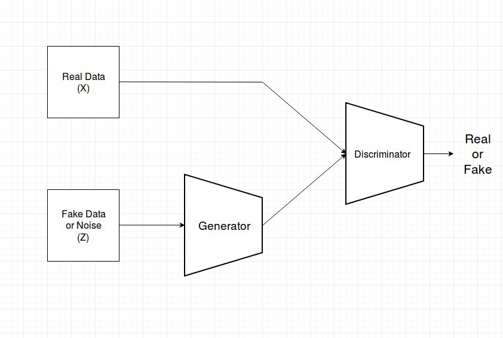
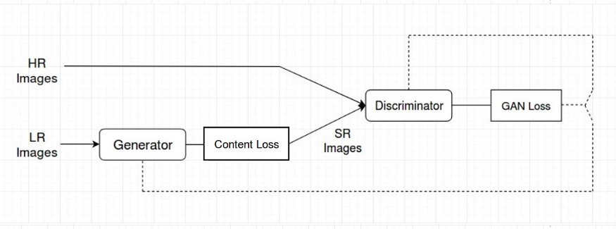
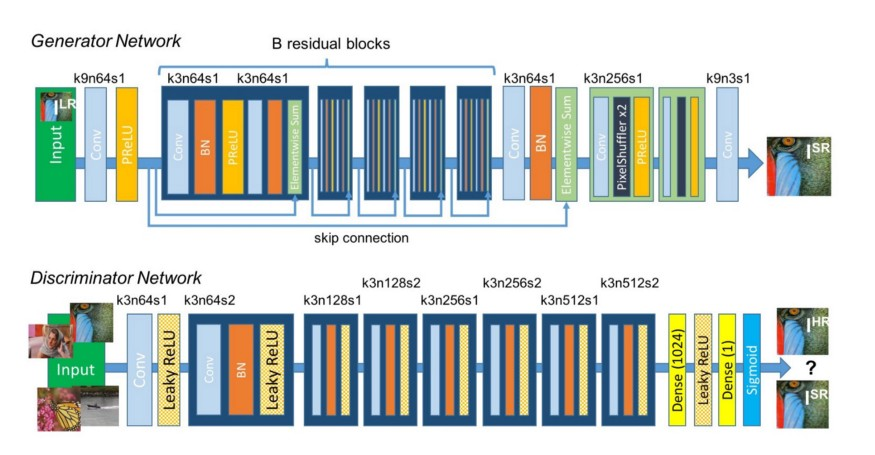
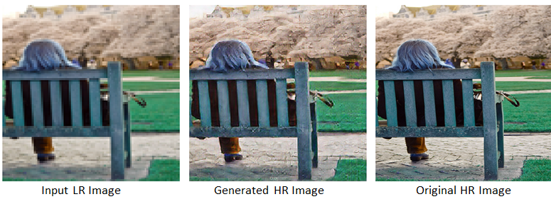
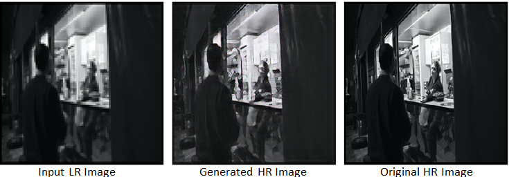

# Super Resolution Using GAN

## Objective
- The main objective was recover or restore high resolution image from low resolution image.
- In this project low resolution images were converted to high resolutions images by applying Generative Adversarial Networks.
- GANs are class of AI algorithms used in Unsupervised Machine Learning. GANs are deep neural network architectures comprised of two networks (Generator and Discriminator) pitting one against the other (thus the “adversarial”) [1].
- 1000 images from the 2017 COCO dataset has been used. Higher number of images and more epochs can be in the training. 

## Loss used
- Usually the focus is on minimizing the mean squared reconstruction error while generating super reolution images. The results have high peak signal-to-noise ratios(PSNR). This means we have good image quality results, but they are often lacking high-frequency details. 
- Hence, perceptual loss[2] function which comprise of Content and Adversarial loss has been used.
- Adversarial loss: A discriminator network that is trained to differentiate between the super-resolved images and original photo-realistic images.
- Content Loss: The VGG loss is defined based on the ReLU activation layers of the pre-trained 19 layer VGG network. VGG loss is defined as the euclidean distance between the feature representations of a reconstructed image and the reference image.
- Refer to the original paper [2] for more details on perceptual loss.
 

## Network Architecture
- The network architecture as propoed in [3] has been used.
- Residual blocks: Since deeper networks are more difficult to train, residual layers have been used.
- PixelShuffler x2: This is feature map upscaling. 2 sub-pixel CNN are used in Generator. There are various ways to do that. In code keras inbuilt function has been used.
- PRelu(Parameterized Relu): PRelu in place of Relu or LeakyRelu has been used. It introduces learn-able parameter that makes it possible to adaptively learn the negative part coefficient.
- k3n64s1 this means kernel 3, channels 64 and strides 1.

## Note for training the network
- The GAN losses don't stabilize unless you first pretrain the generator.
- The network will still end up being able to improve image quality if you don't, but it will be only from the VGG loss and the GAN part will be basically useless.
- First the generator is pre-trained to minimize the MSE between the training inputs and the training targets with no GAN.
- Once this model is trained, removed we will continue training (using VGG perceptual loss + GAN loss and training the descriminator in the training loop) For more info (https://www.fast.ai/2019/05/03/decrappify/)

##References
- [1]: https://arxiv.org/pdf/1609.04802.pdf
- [2]: https://arxiv.org/pdf/1603.08155.pdf
- [3]: https://arxiv.org/pdf/1609.04802.pdf
- 